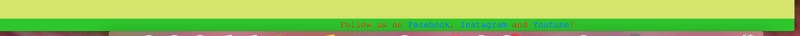

# [HEALTHY WARMING SOUPS](https://boka-krista.github.io/Healthy-warming-soups)

My original plan was to create a website dedicated to some soup recipes so it becomes like online version of a cookbook with various soups which are very popular around the Europe. All of used recipes I've known since my early childhood, so finding images and using the actual recipes were used form my memory. 

Main goal for creating this type of website is that nowadays people tend to find new interesting or even fancy food ideas online, so in this page it all would be together as an healthier choice for dinner, and tried to make sure that it is made in a way so it is easy to follow and the additional information is in different page whcih would not overwhelm people by scrolling too much and trying to find the start of the recipe (which I know could be annoying sometimes). 

Then I decided to add some "history" and general information about them - where the soups are coming from and to make things more interesting used youtube links for different verions of the same product.
Most of the information I've found on wikipedia and some online magazines, which seemed relevant so much so that I used one of the links on my main page for people to have a look at it as weel (few facts of why they are benefitial in your diet).

## UX

Original web design idea I got from one of the walk through lessons which was about wiskeys. When started working on it, couple times I accidentally deleted part of the code, so had to start over. Then I slowly "moved" away from that idea and started to make my own little changes such as removing quotes and changing the image position and instead of that added some generalised information about the soups so the home page would not look too empty. 

in about page I decided to put some history behind each of the soups so people woudn't habe to do additional search in case they were interested where these recipes originally come from. 

Each soup recipes been used from my memory and additional google search to make sure I don't forget anything about it.

Then there was an idea of adding signing up page so in theory people could sign up so follow for more relevant content - new soup recipes without struggles to find the right website.

### Colour Scheme

Homepage: rgb(218, 233, 119) used for background and rgb(108, 40, 171) for text.
About page: lavander for background colour and blueviolet for text.
Borsch: darksalmon colour for background and navy colour for text.
Split peas soup: goldenrod for background colour and rgb(59, 83, 83) for text.
Souerkraut soup: khaki as background colour and green for text.
Sign up page: aqua for background and default (black) for text.
Thank you page: chartreuse for background colour and blueviolet for text.

### Typography

All the fonts I chose I've got inspiration from w3schools website, where before choosing I could test it on how it would look like.
Here is the used link: https://www.w3schools.com/cssref/playdemo.php?filename=playcss_font-family .

## Features

### Existing Features

- **Navbar section #1**

  A chance for people to navigate through pages.

- **A button for external link for benefits of soups #2**

    This is to give a chance to people to read more about benefits of including soups in their diets, in case they get interested in reading up on that.

- **External link to video tutorials  #3**

    -This gives a people chance to follow a video tutorial in case it is easier for them to watch the video instead of reading instructions.

- **Image  #4**

Added images in pages, so the website looks more pleasing and gains curiosity to try the recipes.

- **Footer  #5**

To give a chance to people to follow pages activity across social media.

- **Signing up  #6**

Giving a chance to sign up for more content of the page.

- **Thank you note  #7**

To make people more valued about signing up to page.

### Future Features

- More recipes #1
    - Adding more recipes, which possibly could be also unusual.
- Uploading recipes #2
    - To give a chance to customers to upload their own recipes, if from other cultures -even better.
-  Coment section #3
    - To give a chance to customers to coment/rate used recipes.

## Tools & Technologies Used

- [HTML](https://en.wikipedia.org/wiki/HTML) used for the main site content.
- [CSS](https://en.wikipedia.org/wiki/CSS) used for the main site design and layout.
- [CSS Flexbox](https://www.w3schools.com/css/css3_flexbox.asp) used for an enhanced responsive layout.
- [CSS Grid](https://www.w3schools.com/css/css_grid.asp) used for an enhanced responsive layout.
- [JavaScript](https://www.javascript.com) used for user interaction on the site.
- [Git](https://git-scm.com) used for version control. (`git add`, `git commit`, `git push`)
- [GitHub](https://github.com) used for secure online code storage.
- [GitHub Pages](https://pages.github.com) used for hosting the deployed front-end site.
- [Gitpod](https://gitpod.io) used as a cloud-based IDE for development.
- [Codeanywhere](https://codeanywhere.com) used as a cloud-based IDE for development.
- [Bootstrap](https://getbootstrap.com) used as the front-end CSS framework for modern responsiveness and pre-built components.

## Credits

Main inspiration of pages layout comes from wiskeys talkthrough videos at Code Institute. 
Images been taken from google search about relevant soups.
Information in about page taken from wikipedia. 
Clickable links in recipe pages found on youtube.
Content in main page is from google searches.
Parts of the code been checked in walkthrough videos, bootstrap and w3shcools website.

### Content

| Source | Location | Notes |
| --- | --- | --- |
| [Markdown Builder](https://tim.2bn.dev/markdown-builder) | README and TESTING | tool to help generate the Markdown files |
| [W3Schools](https://www.w3schools.com/howto/howto_js_topnav_responsive.asp) | entire site | responsive HTML/CSS/JS navbar |
| [W3Schools](https://www.w3schools.com/howto/howto_css_modals.asp) | contact page | interactive pop-up (modal) |
| [Bootstrap] (https://getbootstrap.com/docs/4.0/components/dropdowns/) | page | examples for dropdown menu bar |
| [YouTube](https://www.youtube.com/watch?v=Q0KNxDpt71c&t=516s) | PP3 terminal | tutorial for aligning image and text |

### Media

https://www.youtube.com/watch?v=9pqj05Z-h44 - borrowed link for Ukrainian borsch recipe.
https://www.youtube.com/watch?v=K4WKgi8m97I - borrowed link for yellow split peas soup recipe.
https://www.youtube.com/watch?v=k6UIakjhnfM - borrowed link for souerkraut soup recipe.
https://www.saga.co.uk/magazine/health-wellbeing/diet-nutrition/nutrition/10-reasons-eat-soup - borrowed link to article about benefits to eat more soups.

### Acknowledgements

- I would like to thank my Code Institute mentor, [Tim Nelson](https://github.com/TravelTimN) for their support throughout the development of this project.
- I would like to thank the [Code Institute](https://codeinstitute.net) tutor team for their assistance with troubleshooting and debugging some project issues.
- I would like to thank the [Code Institute Slack community](https://code-institute-room.slack.com) for the moral support; it kept me going during periods of self doubt and imposter syndrome.
- I would like to thank my ex-partner, for occationally taking our daughter for a few days so I could spend a bit more time creating page.
- I would like to thank my stepdads brother, who also recently finished web development courses which gave me some tips on how to improve the page and code.

[def]: documentation/nav-bar-feature.png